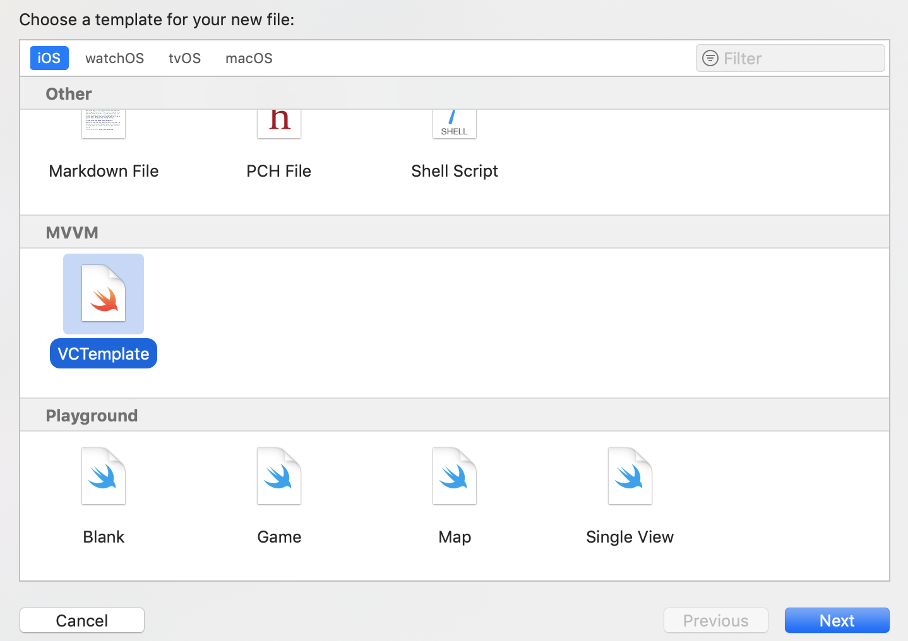

## Add Xcode File Template
Open Finder app and navigate to your Xcode folder in Finder using ⇧⌘G — “Go to folder” and paste ~/Library/Developer/Xcode/

copy Tempalates Folder from cloned repo.



Use VCTemplate to add new ViewController

To instantiate MyViewController use:
```swift
MyViewController.create()
```
## Author

* **Ivan Denezhkin** - *Initial work* - [IvanDenezhkin](https://github.com/IvanDenezhkin)
